# Mermaid使用

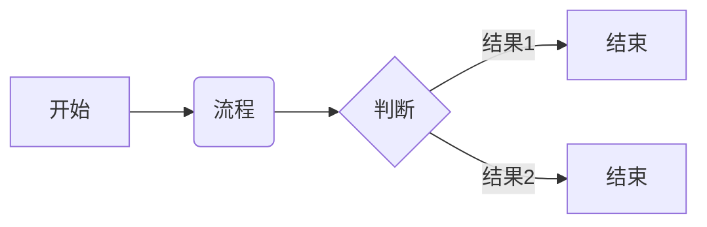

## 简单流程图

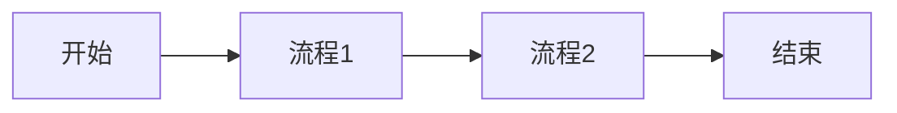

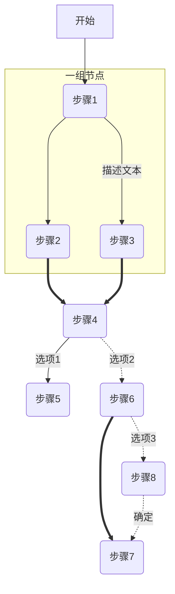

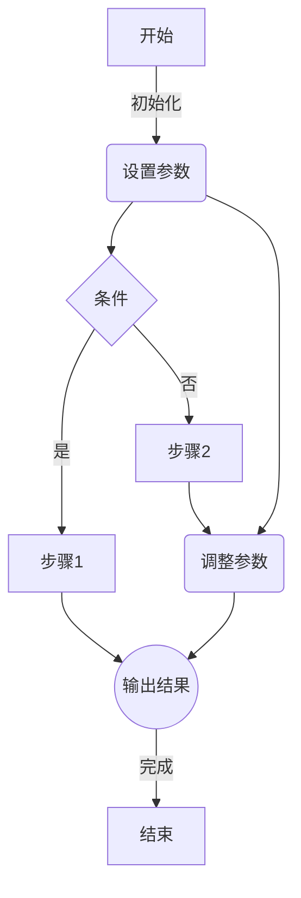

## 复杂流程图

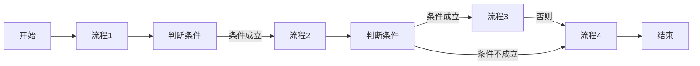

## 子图

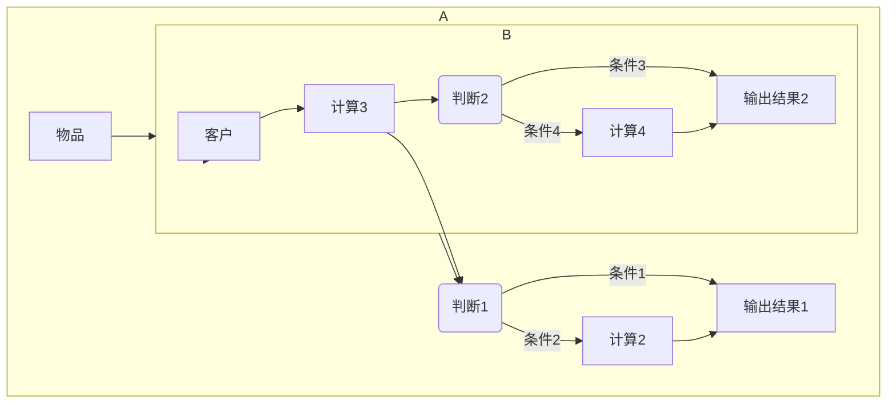

## 类图

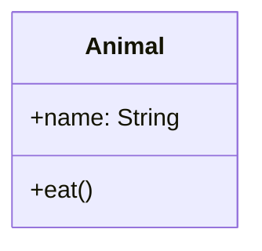

## 状态图

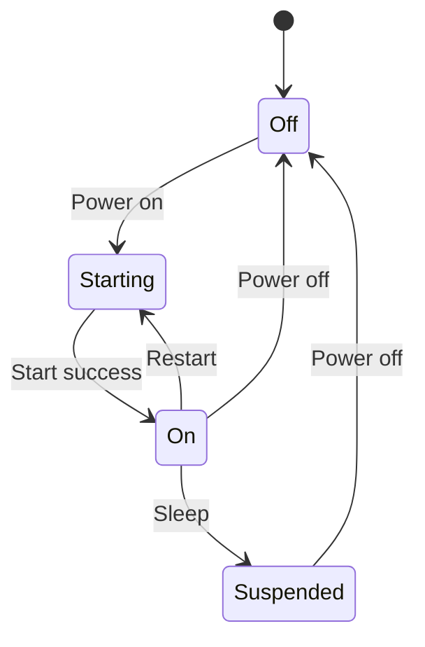

## 时序图

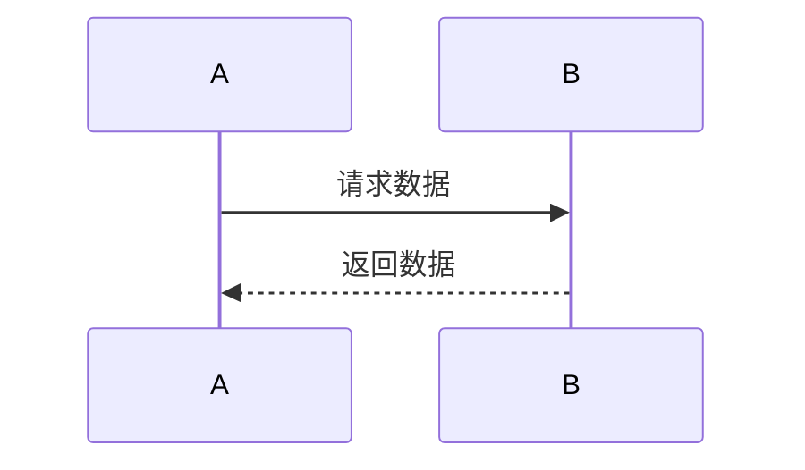

## 甘特图

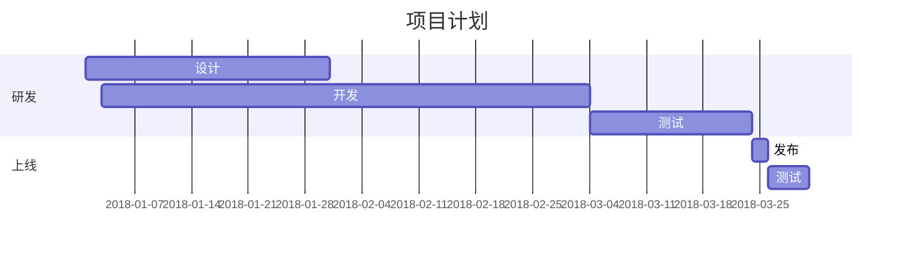

## 树状图

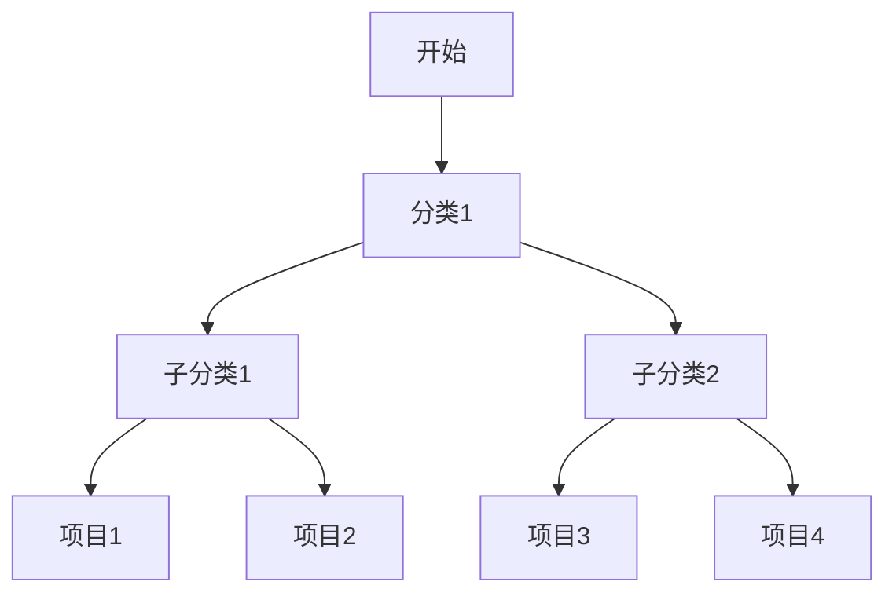

## 矩形图

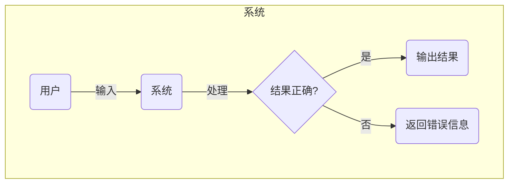

## 异步流程图

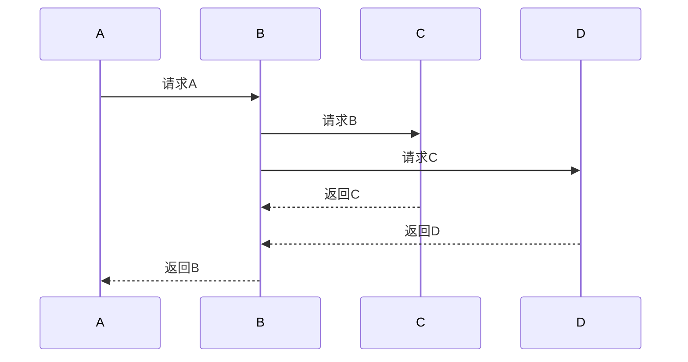

## 流程图

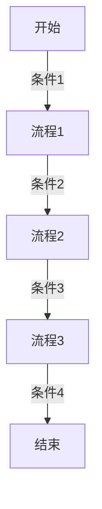

## 状态转换图

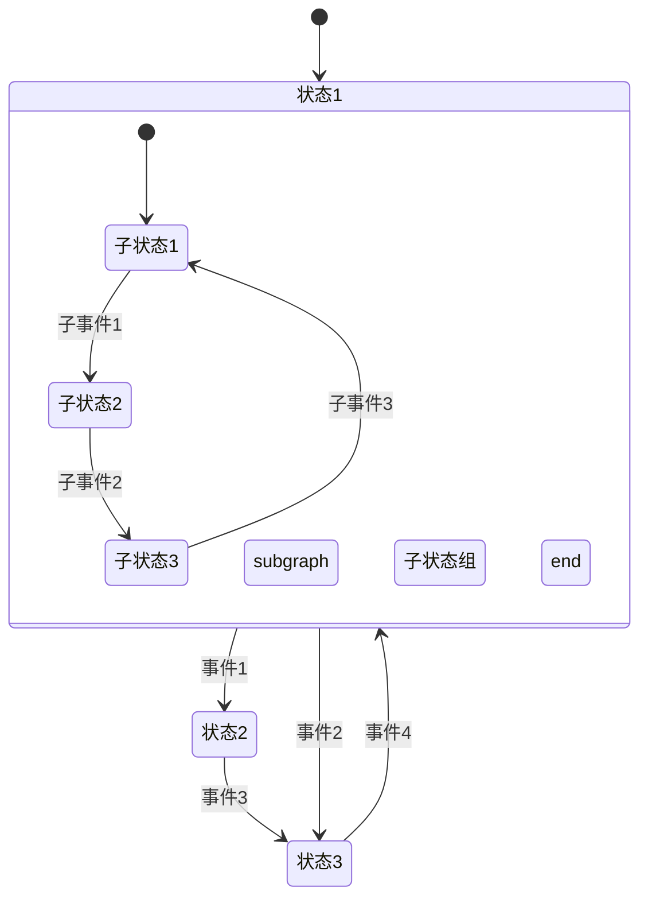

## 强调样式

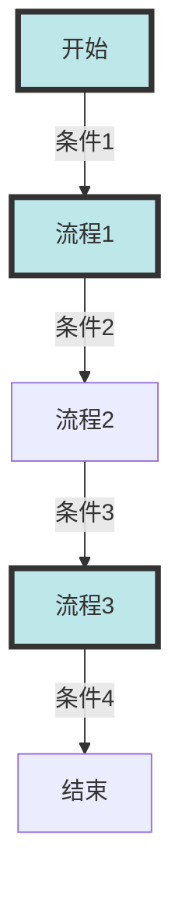

## 字体样式

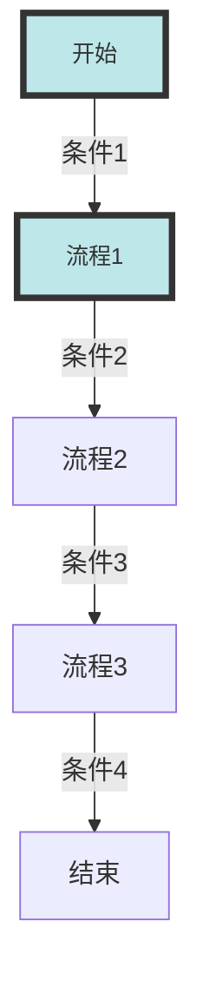

## 样式继承

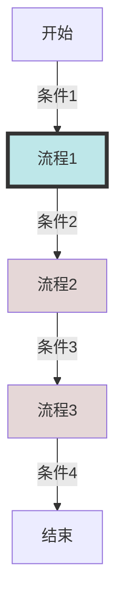

## 自定义节点类型

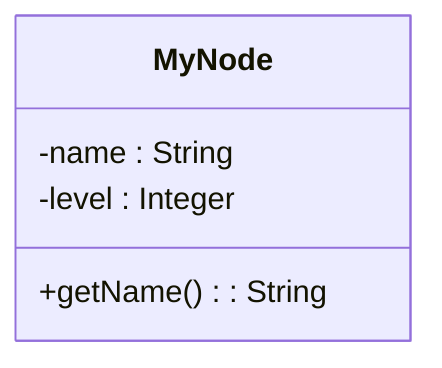

## 点击事件


## 容器

```mermaid
graph TB
  subgraph A
  	B
  end
```

## Git图

```mermaid
gantt
  title Git 进化史
  dateFormat YYYY-MM-DD
  section 远古时代
  创建 Git :a1, 2005-04-12, 15d
  section 现代化时代
  GitHub 购买 Git :a2, 2018-06-04, 1d
  section 近期时 
  Microsoft 收购 GitHub :a3, 2018-06-04, 1d
```

## 用户定义样式

```mermaid
flowchart TD
  A[项目] -->|使用存储过程| B((数据库))
  B -->|更新数据表| C{数据表}
  C -->|检查结果| D[是否满足要求]
  style A fill:#BEE7E9,stroke:#333,stroke-width:4px
  style B fill:#BEE7E9,stroke:#333,stroke-width:4px,stroke-dasharray: 5, 5
  style C fill:#BEE7E9,stroke:#333,stroke-width:4px,stroke-dasharray: 5, 5
  style D fill:#BEE7E9,stroke:#333,stroke-width:4px,stroke-dasharray: 5, 5,font-size:14px
```

## 数字属性

```mermaid
graph TD
  A[顶部] ==>|50| B[中部]
  B <==>|25| C[底部]
```

## 饼图

```mermaid
pie title 人员构成
  "工程师" : 43
  "销售" : 20
  "市场" : 17
  "其他" : 5
  "管理" : 15
```


